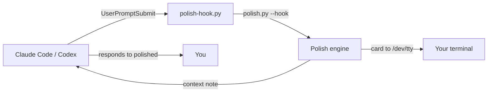

# ✨ prompt-polish

[](https://github.com/SemihMutlu07/prompt-polish/actions)
[]()
[]()
[]()

**English improvement CLI for non-native devs.** Works standalone, or hooks into Claude Code / Codex / AGY — every prompt becomes a learning card.

Zero dependencies. API key optional (falls back to `claude -p`).

---

## 🇹🇷 Neden bu araç?

AI kullanırken İngilizceni geliştiren terminal aracı. Prompt engineering asistanı **değil**, dil öğrenme arkadaşı.

AI'a göndereceğin prompt'u alır, daha akıcı İngilizce versiyonunu, yapılan düzeltmelerin Türkçe açıklamalarını ve 1-2 kelimelik mini vocabulary kartını gösterir. Kartı okursun, dilin gelişir, sonra AI cevabını alırsın.

```
╭──────────────────────────────────────────────╮
│ ✨ Prompt Polish                             │
│                                              │
│ Original prompt                              │
│   write code for sort algorithm fastly       │
│                                              │
│ ✓ Revised                                    │
│   Could you help me write code for a fast    │
│   sorting algorithm?                         │
│                                              │
│ 📝 Improvements                              │
│   • word choice                              │
│     ✗ fastly                                 │
│     ✓ fast                                   │
│     "fastly" bir kelime değil; sıfat olarak  │
│     "fast" kullanılır.                       │
│                                              │
│ 📖 Vocabulary                                │
│   • sorting algorithm                        │
│     → sıralama algoritması                   │
│     ↩ alt: ordering method                   │
╰──────────────────────────────────────────────╯
│ Use revised? [Y/n]
```

---

## 🇬🇧 What is this?

A CLI tool that:
1. Takes your rough English prompt
2. Rewrites it in fluent English
3. Shows you **what** changed and **why** (in Turkish)
4. Teaches 1-2 vocabulary words from the context
5. Sends the polished version to your AI agent

**Not a prompt engineer. A language learning buddy.**

---

## 📦 Kurulum / Installation

### Option A: pip (coming to PyPI)

```bash
pip install prompt-polish
polish --setup   # only if you want to use your own API key
```

### Option B: git clone (current)

```bash
git clone https://github.com/SemihMutlu07/prompt-polish
cd prompt-polish

# Standalone CLI
ln -s "$(pwd)/polish.py" ~/.local/bin/polish

# Or: auto-install CLI + Claude Code/Codex hooks
./install.sh --apply
```

### No API key? No problem.

If you have Claude Code installed, polish will use `claude -p` as a fallback — zero config, zero extra cost.

```
polish "write code for sort algorithm fastly"
```

Need a custom backend? Set one via env:

```bash
export POLISH_API_KEY=sk-or-...
export POLISH_BASE_URL=https://openrouter.ai/api/v1
export POLISH_MODEL=openai/gpt-4o-mini
polish --setup   # or set via config file
```

---

## 🚀 Kullanım / Usage

### Standalone CLI

```bash
polish "write code for sort algorithm"    # argument
echo "explain recursion" | polish         # pipe
polish                                    # interactive (Ctrl+D when done)
polish --file prompt.txt                  # from file
polish --setup                            # configure API key
polish --hook "write code"                # JSON output for harness adapters
```

Output goes to **stdout**, the card to **stderr** — pipe-friendly:

```bash
polish "write code" | hermes ask     # pipe polished prompt into Hermes
polish "write code" > prompt.txt     # save to file
```

### AI Agent Integration

Once installed, every prompt to Claude Code / Codex automatically gets polished:

```bash
# Inside Claude Code or Codex, just type normally:
write code for sort algorithm fastly

# A card appears in your terminal with improvements + vocab,
# then your agent responds to the polished version.
```

**Claude Code / Codex** — `./install.sh --apply` adds it as a `UserPromptSubmit` hook.

**AGY (Google Gemini CLI)** — copy `adapters/AGY_GEMINI.md.example` to `~/.gemini/GEMINI.md`. The instructions tell AGY to polish inline (zero extra API calls).

**Hermes** — add this to `~/.hermes/config.yaml`:

```yaml
hooks:
  pre_llm_call:
    - command: python3 /home/your-user/prompt-polish/adapters/polish-hook.py
```

### Disable hooks temporarily

```bash
POLISH_HOOK_DISABLE=1 claude    # or codex, agy, etc.
```

---

## ⚙️ Konfigürasyon / Configuration

`~/.config/prompt-polish/config.json` (0600 permissions):

```json
{
  "api_key": "sk-or-...",
  "base_url": "https://openrouter.ai/api/v1",
  "model": "openai/gpt-4o-mini"
}
```

Env var overrides: `POLISH_API_KEY`, `POLISH_BASE_URL`, `POLISH_MODEL`.

Any OpenAI-compatible API works: OpenRouter, DeepSeek, Together, Groq, etc.

---

## 🧪 Test

```bash
python3 test_polish.py
# → ok — 15/15 checks passed (no network required)
```

---

## 🔬 Nasıl çalışır / How it works

### API mode


### Auto-hook mode (Claude Code / Codex)



### AGY mode

```
GEMINI.md instructs AGY → AGY detects rough English → Polishes inline
→ Shows card + vocab → Responds to polished version
```

### Claude fallback mode

```
No API key → polish.py calls `claude -p` → reuses existing Claude Code auth
→ No extra cost, no config
```

---

## 📋 Sınırlar / Limitations

- Hook sistemi prompt'u **sessizce** değiştiremez (resmi Claude Code API constraint). Bunun yerine LLM'e context notu enjekte eder: "user is practicing English, treat revised as authoritative."
- Slash commands (`/model`, `/help`) otomatik atlanır.
- Her hook çağrısı ~1-2 sn gecikme ekler. Hata/timeout'ta prompt asla bloklanmaz (fail-open).

---

## 🌟 Neden yıldızlamalısın?

If this tool helps you write better English prompts, star the repo. It helps other non-native devs find it too.

- **First tool** that combines coding agent hooks + language teaching + Turkish explanations
- **Zero dependencies** — Python stdlib only
- **Works everywhere** — Claude Code, Codex, AGY, Hermes, or standalone

[⭐ Star on GitHub](https://github.com/SemihMutlu07/prompt-polish)

---

## 🗺️ Roadmap

See [`CHANGELOG.md`](CHANGELOG.md) for releases. Planned:

- [ ] PyPI publish (`pip install prompt-polish`)
- [ ] Ollama local LLM support
- [ ] SRS flashcards (spaced repetition)
- [ ] CEFR levels (A1–C1)
- [ ] Multi-language (Spanish, Portuguese, Chinese...)
- [ ] Output translation (AI replies → Turkish)

---

## 📄 License

MIT — use it, share it, fork it.